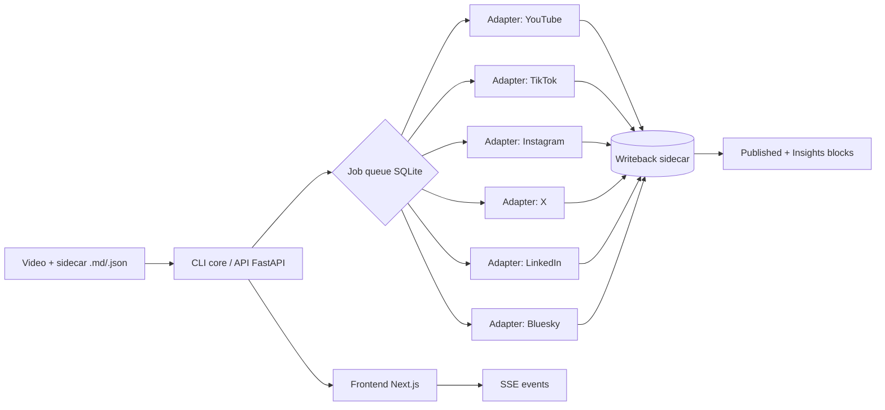

# socialdrop

[](https://github.com/DanielPPerez/socialdrop2.0/actions/workflows/ci.yml)
[](https://codecov.io/gh/DanielPPerez/socialdrop2.0)
[](LICENSE)

**Drop a video and a markdown file into a folder. Every platform publishes itself.**




## Install

```bash
pipx install socialdrop            # core
pipx inject socialdrop socialdrop[youtube,bluesky,watch]   # optional extras
```

## Quickstart

```bash
git clone https://github.com/DanielPPez/socialdrop2.0
cd socialdrop2.0
cp vendor/socialdrop/.env.example vendor/socialdrop/.env
docker compose up --build
```

Open `http://localhost:3000` (frontend) and `http://localhost:8001/docs` (API).

## How it works

1. **Drop folder**: put a video (`my-video.mp4`) next to a sidecar (`my-video.md` or `.json`).
2. **Sidecar metadata**: frontmatter YAML/JSON with title, schedule, platforms config.
3. **Publish**: API or CLI queues jobs per platform. Adapters use official OAuth APIs.
4. **Writeback**: results are appended idempotently into the same sidecar under `<!-- socialdrop:published:start -->` and `<!-- socialdrop:insights:start -->`.
5. **Insights**: `stats` refreshes metrics and writes a consolidated table.

```markdown
---
title: My launch video
schedule: 2026-08-30 10:00 America/New_York
platforms:
  youtube: { visibility: public }
  tiktok:  { privacy: PUBLIC_TO_EVERYONE, duet: true }
  x:       { caption: "Different hook for X" }
  bluesky: {}
hashtags: [buildinpublic]
---
```

## Screenshots

### Connect account


### Create drop


### Publish and insights


## Architecture

- **CLI** (`vendor/socialdrop/src/socialdrop/cli.py`): Typer commands for local use.
- **API** (`vendor/socialdrop/src/socialdrop/api/`): FastAPI async, same adapters as CLI.
- **Frontend** (`web/`): Next.js + TanStack Query + SSE.
- **Queue**: SQLite-backed job queue with exponential backoff.
- **Notifications**: Discord webhook and SMTP.
- **Logs**: structlog JSON, correlated by `drop_id`.

## Demo GIF

To record the dashboard demo GIF:

1. Start the stack with `docker compose up --build`
2. Open `http://localhost:3000`
3. Run `python docs/record_demo_gif.py` (requires `ffmpeg`)
4. Replace `docs/assets/dashboard-demo.gif` with the recorded file
5. Run `python docs/take_screenshots.py` and save the screenshots into `docs/assets/`

## Deploy public demo

See [docs/DEPLOY.md](docs/DEPLOY.md).

We recommend **Railway** for a public demo because it runs Docker Compose
natively and gives you a public URL in minutes.

## Contributing

See [CONTRIBUTING.md](CONTRIBUTING.md).

## License

MIT
